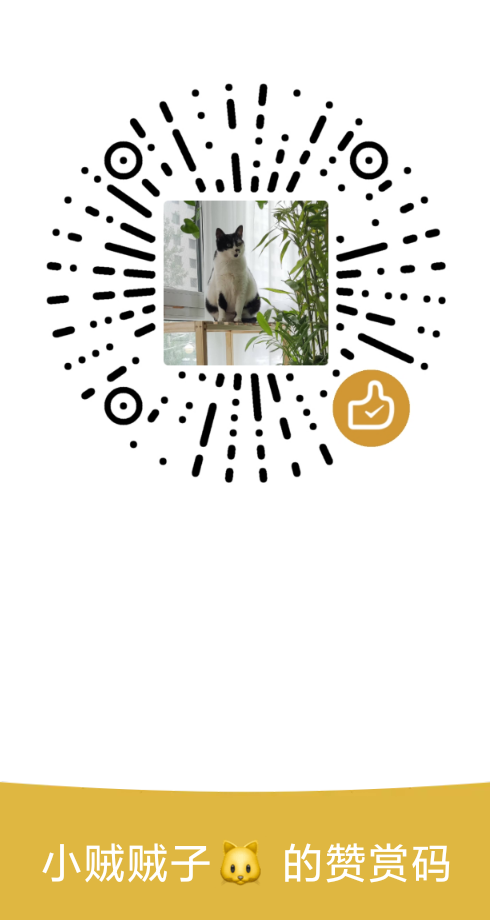

<a href="https://www.wangyunf.com/blossom-demo/#/settingindex">💻️ 试用</a> | <a href="https://www.wangyunf.com/blossom-doc/index.html">📃 文档</a> | <a href="https://www.wangyunf.com/blossom-doc/guide/about/download.html">📥 下载</a>

Blossom-local 是一个基于 Blossom 的本地版本, 所有文件均保存在本地，不做任何破坏性的改动，文件关系实时映射。

支持 Windows。

  

# 👏 Blossom 的特点:

### 完善的文件关系

基于 Markdown 编写，没有破坏性的语法拓展，在这里编写的内容在任何 Markdown 软件中都能正常显示。

### 丰富的附加功能

- 番茄钟
- 图片管理
- 字数统计、编辑热力图、天气预报、主题设置...

  

# 🥳 加入群聊

加入群聊进行沟通，反馈问题。

# 🤝 赞助 Blossom

**Blossom 不会向你收取任何的费用，你可以永久免费使用！**

但开源软件的收益目前很难维持生活，并且项目设计，开发，测试需要大量的时间和精力，如果你愿意赞助我的工作，将非常有助于该项目的成长，并激励我长期持续下去！

**感谢每一个位赞助者对 Blossom 的大力支持，Blossom 因为你们变得更好。**

  

---

<h4 align="center">你可以通过以下几种方式赞助 Blossom。</h4>

